# 厦门工学院本科毕业论文（设计）LaTeX 模板

这套模板用于排版厦门工学院本科毕业论文（设计），包含封面、声明页、中英文摘要、目录、正文、参考文献、总结、谢辞和附录。仓库提供一份空白模板，以及一份已经填入内容的 AI 示范论文。

**正式写论文用空白模板，学习写法时对照 AI 示范论文。** 两份材料中的文件名基本相同，读懂示例后，就能回到空白模板的同一位置修改。不需要额外下载其他教学项目。

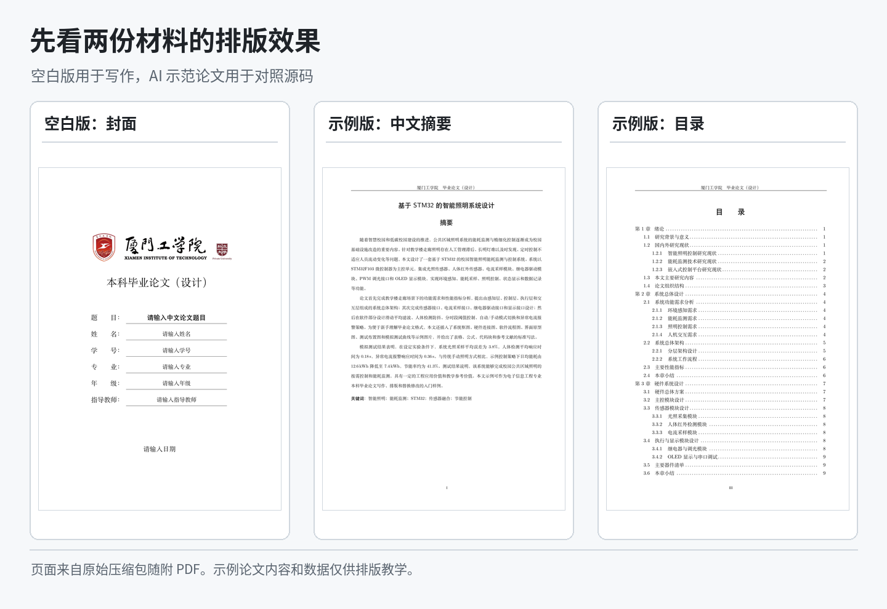

*配图取自原包随附的 PDF。AI 示范论文中的课题、图表和测试结果用于排版教学，不应作为真实研究成果提交。本模板为非官方项目，正式提交前请核对所在学院、专业和指导教师当年的要求。*

**查找内容：** [上传与编译](#start) · [封面和摘要](#metadata) · [正文与目录](#chapters) · [图表、公式和代码](#objects) · [参考文献](#references) · [常见问题](#help) · [本地编译与字体](#local)

<a id="start"></a>
## 下载哪一份，怎样开始

准备正式写论文，下载 [厦门工学院毕业设计论文模板.zip](厦门工学院毕业设计论文模板.zip)。它保留了章节结构和中文注释，正文中的“请输入……”和“这里填写……”需要换成自己的内容。空白模板的 `figures/` 目前只有封面使用的 `logo.png`，不会自带你的系统框图或实验图片。

想先看看完整论文的写法，下载 [厦门工学院AI示范论文.zip](厦门工学院AI示范论文.zip)。解压后打开 `preview.pdf`，可以看到“基于 STM32 的智能照明系统设计”的排版效果。需要学习插图时，对照 `chap/chapter2.tex`；需要看公式时，查看 `chap/chapter3.tex`；参考文献在 `ref.bib`，代码附录在 `chap/appendixA.tex`。后文会直接用这些已有内容讲解。

在 GitHub 点击文件名进入文件页面后，可以下载对应 ZIP。也可以从仓库首页的 `Code > Download ZIP` 下载整个仓库。后一种方式得到的是外层压缩包，**先把它解压，再取出里面的单个论文 ZIP**。上传论文时，不要把装着两套模板和 README 配图的外层压缩包传上去。

### 先选在线平台，再选编译器

第一次接触 LaTeX，可以先用浏览器打开在线平台，无需在电脑上安装 TeX Live。**Overleaf、LoongTeX 是写论文的平台，XeLaTeX 是平台中负责生成 PDF 的编译器。** 选择平台后，仍需要检查项目的编译设置。

| 名称 | 它负责什么 | 本模板怎么选 |
| --- | --- | --- |
| Overleaf / LoongTeX | 上传文件、编辑源码、查看 PDF 的在线平台 | 任选一个，先完成一次编译 |
| XeLaTeX | 将 `.tex` 源文件编译成 PDF | 本模板必须选它 |
| `main.tex` | 整篇论文的主文件 | 设为主文档，不选单独的章节文件 |
| Biber | 处理 `ref.bib` 中的参考文献 | 本模板已配置 `backend=biber`，不是 PDF 编译器选项 |
| TeX Live 版本 | 平台提供的宏包与工具版本 | 初次先用平台默认版本，成功后记录该版本 |

选择平台时，可以先打开下面两个网站，选自己访问顺畅、能看懂操作界面的一个；如果导师或同学已经使用其中一个，也可以跟随他们，方便交流。

- **[Overleaf][overleaf]**：本页提供对应的操作步骤，可同时对照其官方图文帮助。
- **[LoongTeX（龙文）][loongtex]**：提供中文官网与帮助文档，可按下方“在 LoongTeX 中打开模板”操作。可从官网进入[工作台][loongtex-app]。

不必同时注册两个平台，也不必为了第一次编译先购买订阅。先查看当前账户的可用功能，确认能够上传模板并完成编译；如遇文件大小或编译时间限制，再按平台现行规则处理。平台的收费、访问速度和使用限制可能变化，本教程不保证两者在所有网络和账户下表现相同。

**无论选择哪个平台，开始时都记住：上传单个论文 ZIP → 编译器选 XeLaTeX → 主文件选 main.tex → 编译并检查 PDF。** 本模板明确限制使用 XeLaTeX，不能因为另一个模板使用 pdfLaTeX 或 LuaLaTeX 就照搬设置。Biber 保持现有配置；引用异常时按后文的参考文献排错步骤检查日志。

### 在 Overleaf 中打开模板

LaTeX 的源文件是 `.tex`，排版后的成品是 PDF。“编译”就是把源文件里的文字和命令处理成 PDF。Overleaf 提供在线编辑与编译环境，不打算安装本地软件的同学，可以用它开始。

登录 [Overleaf][overleaf]，在项目列表选择 `New Project`，再选择 `Upload Project`，上传 `厦门工学院毕业设计论文模板.zip`。上传后，文件区应当能看到 `main.tex`、`xitthesis.cls`、`ref.bib` 和 `chap/`。若仍然只有两个 ZIP，看不到这些源文件，说明上传的是外层压缩包，需要重新选择。操作入口可对照 [Overleaf 官方上传图解][upload]。

打开项目设置 `Settings`，进入 `Compiler`，将编译器设为 **XeLaTeX**，将 `Main document` 设为 **main.tex**。设置入口可能是编辑器左下方的齿轮按钮，也可以从 `File > Settings` 进入；旧界面通常从 `Menu` 进入。界面位置有变化时，认准这两个设置名称即可。[编译器设置][compiler]和[主文件设置][main-document]的官方说明中都有截图。

### 在 LoongTeX 中打开模板

1. 打开 [LoongTeX 官网][loongtex]，进入工作台，按网站提示注册或登录。
2. 在项目管理页面选择“新建项目”，在弹窗中选择“上传项目”，然后点击“导入文件”，选择 `厦门工学院毕业设计论文模板.zip`。这几个入口来自 [LoongTeX 官方上传说明][loongtex-upload]。不要上传包含两套模板的仓库外层 ZIP。
3. 导入完成后，点击项目标题进入编辑器，确认文件区能看到 `main.tex`、`xitthesis.cls`、`ref.bib` 和 `chap/`。
4. 根据 [LoongTeX 官方配置说明][loongtex-settings]，点击编辑器中的“小锤头”图标打开配置，在“设置”中检查编译方式。将编译引擎设为 **XeLaTeX**，检查主文件指向 **main.tex**；若平台已经自动识别，也要核对结果。具体字段名称与位置以当前界面为准。
5. 点击 **Compile** 开始编译，等待 PDF 生成。按钮操作见 [LoongTeX 官方编译说明][loongtex-compile]。若失败，查看日志中的第一个错误，不要仅反复点击按钮。

以上 LoongTeX 步骤依据官方公开文档整理，尚未在登录账户中实测本模板。若当前配置界面无法找到主文件或编译器选项，先查阅官方帮助确认入口；不能仅凭上传成功认定模板已经兼容该环境。

### 两个平台都要做的首次编译检查

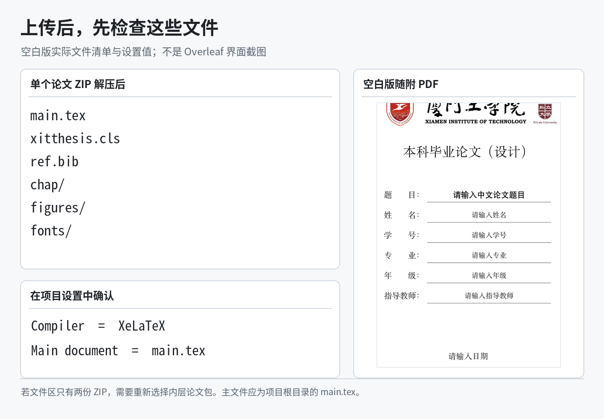

*这是根据原包文件整理的检查图，不是 Overleaf 界面截图。设置中的 XeLaTeX 和 main.tex 分别是编译器与主文件，不能互相替代。*

本模板的样式文件明确要求使用 XeLaTeX。不要选择 pdfLaTeX，也不要把某一章的 `chapter1.tex` 设成主文件。`TeX Live version` 是另一项设置，第一次可以先保留默认值，遇到版本兼容问题时再结合日志处理。

在 Overleaf 点击 `Recompile`，在 LoongTeX 点击 `Compile`，查看生成的 PDF。首次使用可以先不改其他地方，只在 `main.tex` 中找到这一行：

```tex
\XITAuthor{请输入姓名}
```

把大括号中的文字换成自己的姓名，保留命令和大括号，再编译一次。封面姓名也变化了，说明上传、编辑和编译这条流程已经走通，接下来再填写其他内容。

初次运行时先确认四件事：文件区已展开为源码而非仍是 ZIP；编译器是 XeLaTeX；主文件是 `main.tex`；编译成功且新 PDF 显示刚修改的姓名。确认后保存源码备份。以后换平台时，上传完整源码项目并重新检查这些设置；不能只上传 PDF，也不能假设另一平台会保留原来的编译设置。

本节平台入口与操作文档核对日期：2026-09-11。官方界面可能更新，操作位置以当前平台与所链接的官方文档为准。

这里要区分新生成的 PDF 与压缩包自带的预览。`preview.pdf` 是已有快照，不会随源文件修改自动更新；示例版随附 PDF 的封面姓名与当前 `main.tex` 中的姓名也不一致。检查修改结果时，请看**本次成功编译生成的 PDF**，不要拿旧预览判断修改是否生效。

<a id="metadata"></a>
## 填写封面和中英文摘要

封面信息集中在 `main.tex` 的“论文基本信息”部分。下面是空白模板已有的字段，直接在原位置修改，不要把整段重复粘贴到文件末尾。

```tex
\XITSchool{厦门工学院}
\XITThesisName{本科毕业论文（设计）}
\XITTitle{请输入中文论文题目}
\XITEnglishTitle{Please Input English Thesis Title}
\XITAuthor{请输入姓名}
\XITStudentID{请输入学号}
\XITMajor{请输入专业}
\XITGrade{请输入年级}
\XITSupervisor{请输入指导教师}
\XITDate{请输入日期}
\XITChineseKeywords{关键词一；关键词二；关键词三}
\XITEnglishKeywords{keyword one; keyword two; keyword three}
```

例如，填写中文题目时，把 `\XITTitle{请输入中文论文题目}` 改成 `\XITTitle{你的正式论文题目}`。只需要保留反斜杠、命令名称和大括号。题目会用于封面和摘要标题，不必到每一页分别填写。年级按实际入学年级填写，日期按提交要求填写，不要直接沿用示例论文的时间。

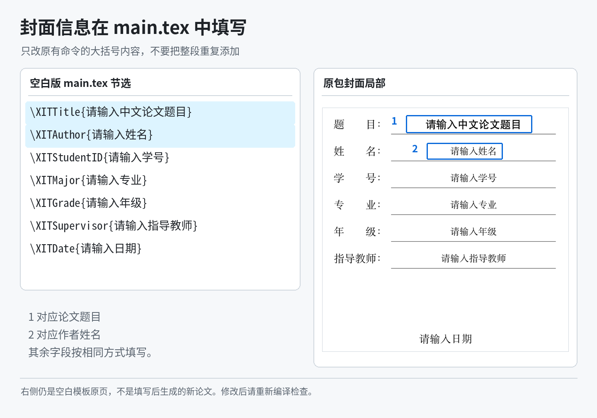

*左侧为原始字段，右侧为原包封面局部。题目和姓名的标注框指出对应位置；它们没有被替换成另外一套论文内容。*

学校标识由 `\XITLogo{figures/logo.png}` 加载，通常可以保留。确需替换时，把新图片放进 `figures/`，同步修改这条路径。封面题目过长时，要检查最终页面，不要用连续空格强行对齐，也不要为了挤进一行擅自缩短已经确定的正式题目。

摘要写在 `chap/abstract.tex`。中文摘要放在 `cnabstract` 环境中，英文摘要放在 `enabstract` 环境中。下面只说明填写位置，不是可以直接使用的摘要范文。

```tex
\begin{cnabstract}
这里填写自己的中文摘要。
\end{cnabstract}

\begin{enabstract}
Replace this paragraph with your English abstract.
\end{enabstract}
```

保留 `\begin{...}` 和 `\end{...}`，替换中间的文字即可。这一对命令标记了摘要的开始与结束。论文题目、“摘要”和“Abstract”标题已经由模板生成，不要再手动写一遍。

**关键词仍在 `main.tex` 中修改。** 中文关键词写在 `\XITChineseKeywords{...}` 中，用中文分号分隔；英文关键词写在 `\XITEnglishKeywords{...}` 中，用英文分号分隔。不要在摘要末尾再补一行关键词，否则会重复。

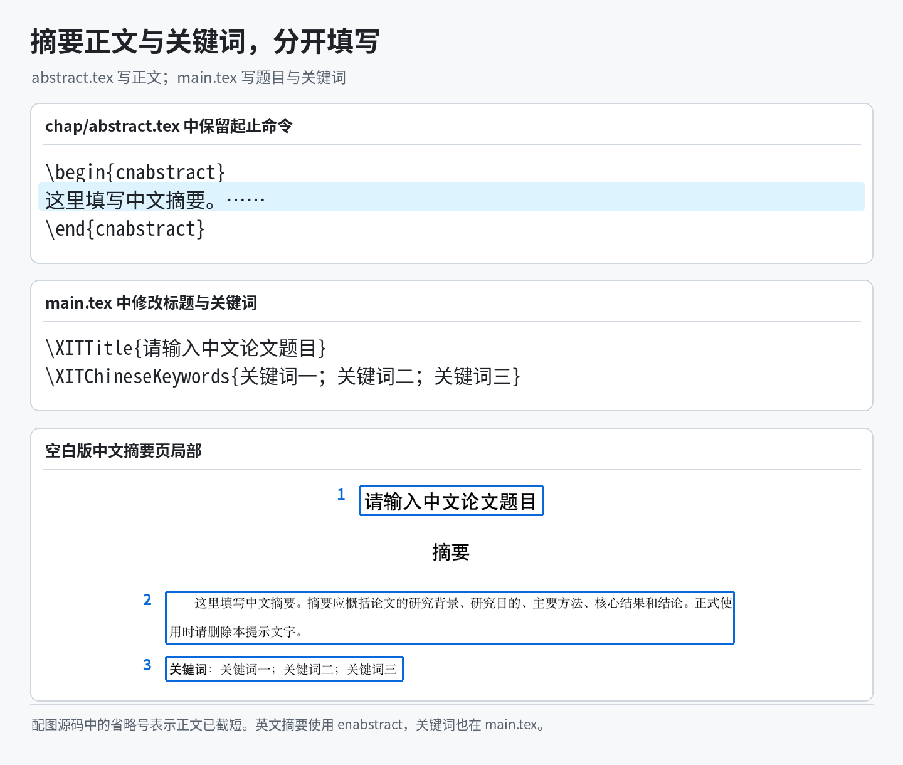

*原包空白摘要页的三个部分分别对应论文题目、摘要正文和关键词。AI 示范论文的 abstract.tex 则提供了填入完整内容后的写法。*

摘要内容应当对应自己完成的研究和实际结果。示例论文中出现的误差、响应时间和节能率是教学模拟内容，不能只替换姓名和题目就用于正式提交。

<a id="chapters"></a>
## 正文写在哪里，目录怎样生成

下面是单个论文 ZIP 解压后的主要文件。它与 GitHub 仓库根目录不是一回事：仓库里的 `docs/images/` 只存放本 README 的配图，不参与论文编译。

```text
main.tex                       全文入口，包含基本信息和章节加载顺序
xitthesis.cls                  模板样式，控制封面、字体、标题和页边距
ref.bib                        参考文献数据
chap/
    abstract.tex               中英文摘要
    chapter1.tex               第 1 章
    chapter2.tex               第 2 章
    chapter3.tex               第 3 章
    chapter4.tex               第 4 章
    chapter5.tex               第 5 章
    conclusion.tex             总结
    acknowledgements.tex       谢辞
    appendixA.tex              第一个附录
    appendixB.tex              第二个附录
figures/                       论文图片；空白版目前只有 logo.png
fonts/README.md                字体配置说明
LATEX_OVERLEAF_GUIDE.md         压缩包内的进一步教程
FORMAT_CHANGELOG.md            版式调整记录
copy_windows_fonts.ps1         Windows 字体复制脚本
Makefile                       本地编译命令
main.pdf / preview.pdf         随包提供的已有 PDF
```

写正文时主要操作 `chap/`，填写信息时操作 `main.tex`。`xitthesis.cls` 是样式文件，姓名和正文不在这里修改。先保留原样；学院有明确的版式调整要求时，再修改对应设置。

打开空白模板的 `chap/chapter1.tex`，可以找到章、节和小节的标题。把标题文字和占位段落换掉，就可以开始写第一章。例如：

```tex
\chapter{绪论}

\section{研究背景与意义}
这里写研究背景。

这里另起一段，说明研究问题和开展这项工作的意义。

\section{相关研究}

\subsection{已有方法}
这里介绍与课题有关的已有研究。
```

`\chapter` 表示章，`\section` 是章下面的节，`\subsection` 再向下一层。标题中的编号由模板生成。写 `\section{研究背景与意义}` 就够了，不要写成 `\section{1.1 研究背景与意义}`。

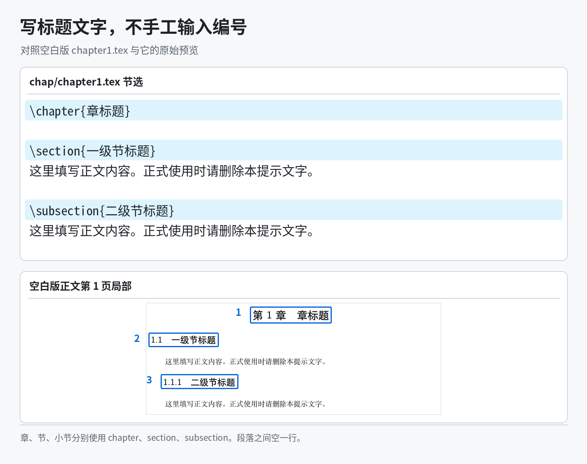

*图中使用原包的占位标题。写自己的论文时修改大括号中的标题文字，前面的“第 1 章”“1.1”“1.1.1”会随结构更新。*

普通中文直接输入。**两段之间空一行**，模板会处理首行缩进。在源文件中只按一次回车，通常仍属于同一段；每段末尾也不用加 `\\`，它是强制换行命令，不能代替正常分段。

源文件中以 `%` 开始的内容是注释，该行后面的内容不会显示在 PDF 中。空白模板里的图片、表格等代码示例也使用了这种写法。启用一段示例时，需要去掉代码行前面的 `%`，但旁边的中文操作说明仍应保留为注释。

半角 `%`、`_`、`&`、`#` 在 LaTeX 中有特殊用途。普通正文里需要显示它们时，分别写成 `\%`、`\_`、`\&`、`\#`，例如：

```tex
误差为 5\%。程序中的变量名为 sensor\_value。
```

命令中的反斜杠、大括号和方括号应当使用英文半角字符。复制本页代码时，只复制代码块里面的内容，不要把外侧的三个反引号和 `tex` 字样一起粘进去。

### 增加或删除章节

`main.tex` 中的加载命令决定哪些章节进入论文，以及它们的顺序。下面这些行已经存在，不必重复添加。

```tex
\include{chap/chapter1}
\include{chap/chapter2}
\include{chap/chapter3}
\include{chap/chapter4}
\include{chap/chapter5}
\include{chap/conclusion}
```

只需要四章时，把第五章入口改为 `% \include{chap/chapter5}`。需要第六章时，在 `chap/` 新建 `chapter6.tex`，写好 `\chapter{你的章标题}` 和正文，再在总结之前加入 `\include{chap/chapter6}`。仅仅新建文件，不会让它自动出现在论文中。

新章节只放章标题和正文，不要再复制 `\documentclass`、`\begin{document}`、`\end{document}`；这些整篇文档的结构已经由 `main.tex` 提供。

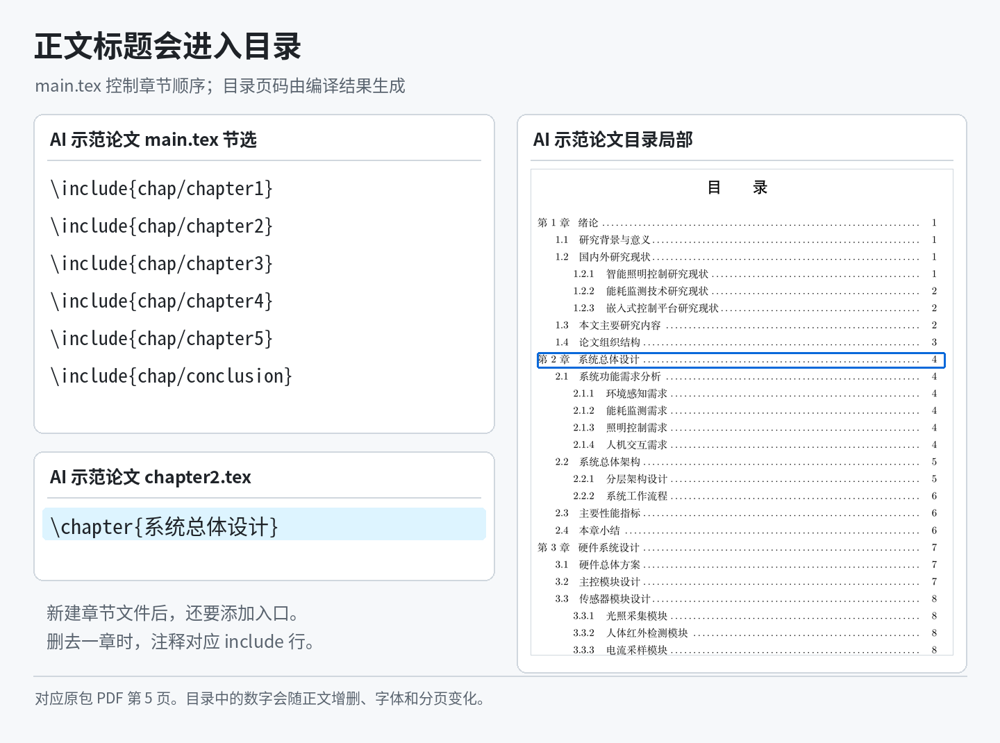

*目录来自 AI 示范论文随附 PDF。目录条目读取正文标题，页码由编译结果确定，不是在 main.tex 中手工填写。*

章节编号取决于加载顺序，不是文件名中的数字。修改标题、增减章节或改变分页后，需要重新编译以更新目录。章节之间自动换页是当前模板的正常行为，不必添加空行把标题推到下一页。

<a id="objects"></a>
## 图片、表格、公式和代码怎样放进正文

下面使用 AI 示范论文中已经存在的内容讲解。可以把示例版和空白版分开打开，一边看写法，一边修改自己的论文，不要把两套同名文件混在一个项目里。

### 先对照示例插入一张图

在 **AI 示范论文**的 `chap/chapter2.tex` 中搜索 `fig:system-architecture`，可以找到系统总体架构图的引用和插图代码。对应图片是示例版已有的 `figures/fig_system_architecture.png`。

```tex
\begin{figure}[htbp]
  \centering
  \includegraphics[width=0.96\textwidth]{figures/fig_system_architecture.png}
  \caption{系统总体架构示意图}
  \label{fig:system-architecture}
\end{figure}
```

`\includegraphics` 后面的大括号是图片路径，`width=0.96\textwidth` 将图片宽度设为正文区域的 96%。一般只设置宽度，让高度按原比例变化，避免把图片拉伸。`\caption` 是图题，`\label` 给这张图设置一个供正文引用的标签。

正文不需要手写“图 2-2”，而是使用同一个标签：

```tex
系统总体架构如图~\ref{fig:system-architecture} 所示。
```

`\ref` 会读取实际编号，`~` 是不换行空格，用于避免“图”和编号被拆到两行。标签放在 `\caption` 后面，并且每张图使用不同的标签。复制第二个插图环境时，记得同时修改路径、图题和标签。

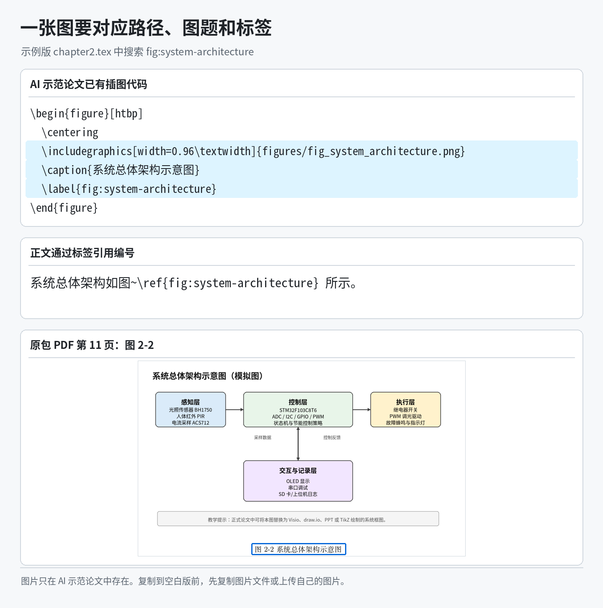

*右侧截取自 AI 示范论文原包 PDF，第 11 页。这里展示的是模拟系统架构，正文中的“图 2-2”由模板生成。*

回到空白模板时，要先上传图片。**空白模板没有 `fig_system_architecture.png`，也没有注释里写的 `example.png`。** 照着示例学习，可以从 AI 示范论文复制相应图片到空白版 `figures/`；正式写作则上传自己的图片，并修改路径、图题和正文分析。只复制代码而没有图片文件，会出现找不到文件的错误。

文件名建议用简短英文、数字和下划线，扩展名、大小写都与实际文件保持一致。`[htbp]` 允许图片在当前位置、页顶、页底或浮动页排放，图片移到下一页不一定是错误。先检查图片大小和正文引用，再看最终版面，不要靠连续回车固定位置。关于浮动位置可参照 [Overleaf 插图说明][images]。

### 三线表的写法

仍在 AI 示范论文的 `chap/chapter2.tex` 中，搜索 `tab:performance-index`，能找到“系统主要性能指标”表。下面是原有代码，表内数值是示例设计目标，不是经过本教程验证的实验数据。

```tex
\begin{table}[htbp]
  \centering
  \caption{系统主要性能指标}
  \label{tab:performance-index}
  \begin{tabular}{p{3.2cm}p{4.2cm}p{5.2cm}}
    \toprule
    指标类别 & 设计目标 & 说明 \\
    \midrule
    光照采样误差 & 不大于 5\% & 与标准照度计读数进行对比 \\
    人体检测响应时间 & 不大于 \SI{0.5}{s} & 人员进入检测区域后的响应时间 \\
    异常电流报警时间 & 不大于 \SI{1}{s} & 电流超过阈值后的报警响应时间 \\
    调光输出范围 & 0--100\% & PWM 占空比可调 \\
    连续运行稳定性 & 不少于 \SI{2}{h} & 无死机、误报警和通信中断 \\
    数据记录周期 & \SI{1}{s}--\SI{60}{s} 可设 & 根据存储容量灵活设置 \\
    \bottomrule
  \end{tabular}
\end{table}
```

`tabular` 后的三个 `p{...}` 定义了三列宽度，这类列允许长文字换行。每一行用 `&` 分隔单元格，用 `\\` 结束，因此这张表每行有两个 `&`。增加一列时，要同时调整列定义和每行内容，不能只在某一行多写一个单元格。

`\toprule`、`\midrule` 和 `\bottomrule` 分别生成顶部、表头下方和底部的横线。模板已经加载 `booktabs`，不需要再次加载。表题放在表格上方，标签紧跟 `\caption`。正文引用写成 `表~\ref{tab:performance-index}`。

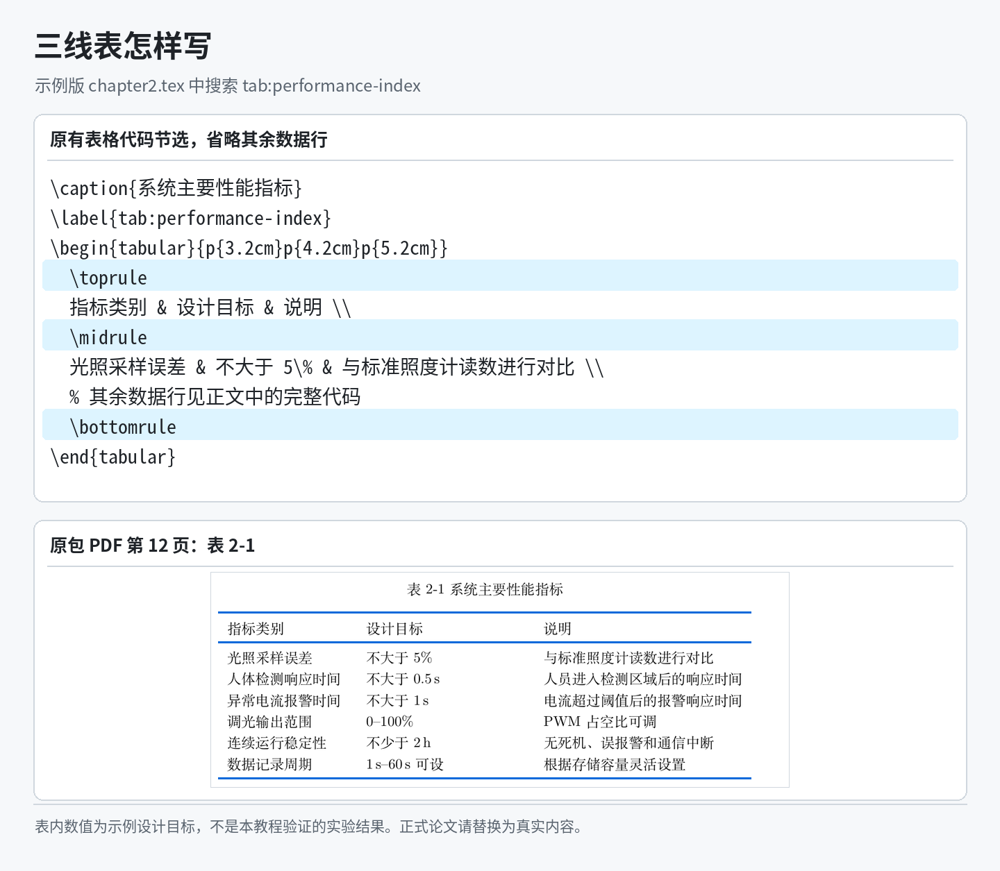

*配图只截取部分源码，完整环境在上面的代码块中。三条标注线对应 top、mid、bottom 三个命令。*

在自己的论文中替换表格标题、数据和说明。表格太宽时，先精简单元格内容、调整列宽，让文字能够换行，不要直接把整张表缩到难以阅读。

### 公式的编号与引用

AI 示范论文的 `chap/chapter3.tex` 中有一个电流采样公式，搜索 `eq:current-sample` 即可找到：

```tex
\begin{equation}
  I = k\left(U_{adc}-U_0\right),
  \label{eq:current-sample}
\end{equation}
```

`equation` 生成独立成行的公式和编号。正文用 `式~\eqref{eq:current-sample}` 引用它，`\eqref` 已经带括号，不需要再手工补一对括号。

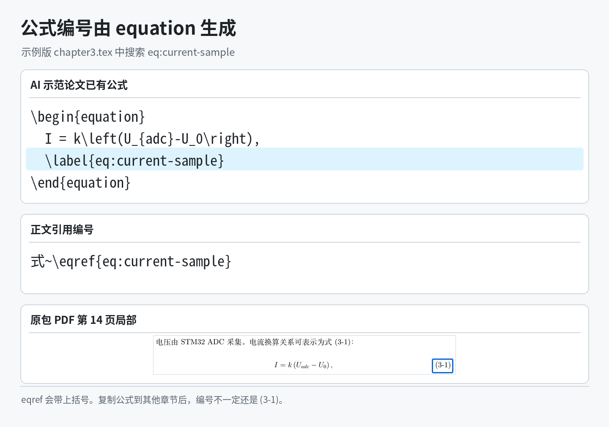

*示例 PDF 中该公式编号为 (3-1)。放到自己的论文后，编号会根据所在章节和公式顺序变化，不应照着截图手填。*

写在句子中的短公式可以用 `\(` 和 `\)` 包起来，例如 `电功率为 \(P=UI\)`。数学环境中的 `_` 表示下标，`^` 表示上标；多个字符需要用大括号括起来，如 `x_{max}`。分式写作 `\frac{分子}{分母}`。不要在 `equation` 中再嵌套一层 `\(...\)`，也不要在公式内部用空行分段。

模板已经加载 `siunitx`，数字和单位可以统一写成下面的形式。这些数值只展示写法，正式使用时按实际参数填写。

```tex
工作电压为 \SI{3.3}{\volt}。
长度为 \SI{10}{\milli\metre}。
环境温度为 \SI{25}{\degreeCelsius}。
```

### 程序代码放在哪里

短代码可以放在正文，较长的关键实现可以放附录。模板使用 `listings` 排版代码，不会替你运行程序。在 AI 示范论文的 `chap/appendixA.tex` 中搜索 `code:uart`，可以看到已有的串口日志示例。

```tex
\begin{lstlisting}[language=C,caption={串口日志输出示例},label={code:uart}]
printf("lux=%.1f,pir=%d,current=%.2f,mode=%d,state=%d\r\n",
       lux_value,
       pir_state,
       current_value,
       system_mode,
       light_state);
\end{lstlisting}
```

这里的 `language=C` 指定代码语言，`caption` 是标题，`label` 用于引用。在 `lstlisting` 里面保留程序原本的写法，不要把代码中的 `%`、`_` 按普通 LaTeX 正文转义。这与前面写正文时的规则不同。

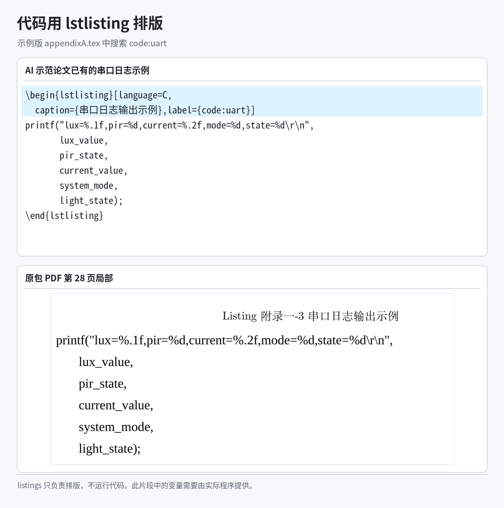

*原包 PDF 将代码标题显示为 Listing。教程保留模板的实际输出，没有将它改画成其他标题样式。*

阅读示例可以学习如何排代码，但示例片段依赖的变量和函数并不都在这段代码里。复制到程序工程前，还需要按自己的实现补齐上下文，不能把“能够排成 PDF”理解为“程序已经验证可运行”。

<a id="references"></a>
## 参考文献怎样添加

参考文献涉及两个位置：`ref.bib` 记录资料的信息，正文中的 `\cite{...}` 指明引用了哪一条。最容易理解的办法，是对照示例版里已经连起来的两处内容。

打开 **AI 示范论文**的 `ref.bib`，搜索 `tan2017-cprogramming`，能找到下面这条记录。这里照录已有条目说明字段关系，不代表对示例数据库进行了文献准确性审查。

```bibtex
@book{tan2017-cprogramming,
  author    = {谭浩强},
  title     = {C程序设计},
  edition   = {5},
  publisher = {清华大学出版社},
  year      = {2017},
  address   = {北京}
}
```

`@book` 表示书籍，`tan2017-cprogramming` 是文献键，相当于这条资料的内部名称。`author`、`title`、`year` 等字段分别记录作者、题目和年份。文献键可以自行命名，建议使用英文、数字和连字符，不要与其他条目重复。

再打开示例版 `chap/chapter1.tex`，搜索同一个文献键，能看到正文这样调用它：

```tex
嵌入式系统的软件实现通常离不开 C 语言程序设计基础\cite{tan2017-cprogramming}。
```

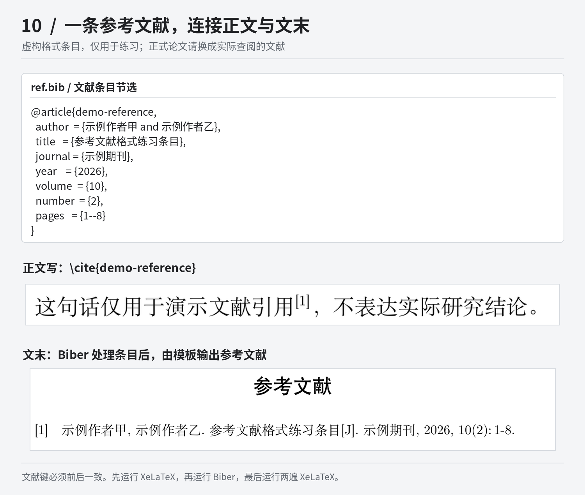

*图中为示例已有的文献条目和 PDF 局部。文献编号取决于正文引用顺序，不能把截图中的 [2] 当作固定编号。*

回到空白模板，把自己实际阅读并准备引用的资料录入 `ref.bib`，再在相关正文中使用对应的 `\cite{文献键}`。多个作者在 BibTeX 字段中用 `and` 分隔；同时引用多条资料，可以写 `\cite{key-one,key-two}`，但这两个键必须已经存在。不要把带 `[1]` 的整段参考文献文字直接粘进 `ref.bib`，那不是数据库条目格式。

期刊论文用 `@article`，会议论文用 `@inproceedings`，学位论文用 `@thesis`，网页资料用 `@online`。不同类型的字段不同，可以从实际检索平台导出 BibTeX 后再核对，不要把所有资料都套成书籍。空白模板的 `sample-reference` 是占位条目；AI 示范论文中也有写着“某某大学”的记录，不能把整份示例文献库直接当作已核验的参考资料。

本模板在 `main.tex` 中使用 `backend=biber` 和 `style=gb7714-2015`。前者指定文献处理程序，后者指定当前排版样式。已经有这套配置，就不要再从其他教程复制一套 `natbib` 或手工参考文献环境进来混用。原理和更多条目写法见 [Overleaf 的 biblatex 说明][bibliography]。

参考文献由 `\XITPrintBibliography` 输出，位置在“总结”和“谢辞”之间。通常只需要修改数据库和正文引用，不需要到 PDF 末页手工维护编号。未被引用的条目默认不出现在列表中，空白模板初始列表为空也可能是这个原因。

若只想检查数据库里的全部条目，可以临时取消 `main.tex` 中 `% \nocite{*}` 的注释。它不能代替正文引用。文献显示异常时，应检查条目语法、文献键和 Biber 日志；单纯反复运行 XeLaTeX 不会补上缺失的文献处理步骤。

## 总结、谢辞和附录

总结写在 `chap/conclusion.tex`，保留开头的 `\XITConclusion`；谢辞写在 `chap/acknowledgements.tex`，保留 `\XITAcknowledgement`。这两个命令已经负责生成标题和目录条目，不需要另外再加 `\chapter{总结}` 或手写一行“谢辞”。

附录文件是 `chap/appendixA.tex` 和 `chap/appendixB.tex`。空白模板中已有 `\XITAppendix{附录标题}`，修改大括号中的文字，再填写内容即可。例如：

```tex
\XITAppendix{系统关键源代码}

这里填写需要补充的说明，并按前文的写法插入代码。
```

模板会生成“附录一 系统关键源代码”，所以不要把“附录一”再次写进大括号，也不需要另外添加 `\appendix`。AI 示范论文的第一个附录展示关键代码，第二个附录说明模拟图片的用途和替换位置，都可以作为结构参考。

没有附录时，在 `main.tex` 中注释入口，而不是只删掉附录正文：

```tex
% \include{chap/appendixA}
% \include{chap/appendixB}
```

仅保留一个附录，就只注释第二行。删除文件但不修改入口会导致找不到文件；只清空正文但保留标题，则可能留下一个空附录。

<a id="help"></a>
## 出错时怎样找原因

每完成一小段内容、一个图表或一组引用就编译一次，比全文写完后集中排错容易。出现错误时，先找日志中的**第一个实质错误**，检查对应文件附近刚改过的内容。后面的很多提示可能只是同一个问题引起的连锁反应。

下面收起了较长的排错说明，遇到对应问题再展开查看。

<details>
<summary>编译失败：编译器、文件、字体或命令报错</summary>

看到 `This class requires XeLaTeX`，先把编译器改成 XeLaTeX。文件开头写了 `% !TeX program = XeLaTeX` 并不等于所有编辑器都会自动采用这项设置，仍要检查实际编译配置。

看到 `File ... not found`，看清缺少的文件名。`xitthesis.cls` 找不到，检查项目是否上传完整；图片找不到，检查是否真正上传、路径是否正确、大小写是否一致。只上传 `main.tex` 不足以编译整篇论文。

`fontspec` 错误需要看日志中具体缺少哪种字体。字体回退也依赖环境里存在相应字体，不能把任何机器上的字体错误都归结为“没选 XeLaTeX”。本地环境与上传字体的说明在下一节。

`Undefined control sequence` 常见于命令拼错，或从其他教程复制了需要额外宏包的命令。`Missing $ inserted` 可以先检查普通正文里未转义的下划线，以及是否把数学内容放错环境。环境不匹配时，检查 `\begin{...}` 和 `\end{...}` 是否成对，大括号是否遗漏。

</details>

<details>
<summary>引用显示 ??、文献不显示，或者目录没有更新</summary>

图表和公式显示 `??`，先核对 `\label` 与 `\ref` / `\eqref` 中的名称是否一致、标签是否重复、相关章节是否被加载。图表标签应放在 `\caption` 后面。源文件无误后，再编译以刷新交叉引用。

文献问题还要检查 `ref.bib` 是否有相应记录、正文是否确实引用了它，以及 Biber 是否成功完成。文献键拼错或数据库括号不配对，都不是多点几次编译就能解决的。

目录页码在增删内容后需要重新计算。确认编译没有实质错误后，再编译一次；缓存确实异常时，Overleaf 可以通过重新编译菜单中的 `Recompile from scratch` 清理生成文件后重编译，具体入口见[官方缓存说明][cache]。清缓存不会修复源代码错误。

</details>

<details>
<summary>源文件已经保存，PDF 却没有变化</summary>

确认当前看的是本次生成的 PDF，而不是随包提供的 `preview.pdf` 或保存在电脑上的旧文件。保存源文件与成功编译是两件事，编译失败后，预览区可能仍显示之前的内容。

再检查 `main.tex` 有没有加载你修改的章节。例如 `% \include{chap/chapter3}` 前面有 `%`，这一章就不会进入论文。分开打开空白版和示例版时，也要确认自己正在编辑哪一个项目。

</details>

<details>
<summary>图片跑到下一页、表格越过页边，或出现 Overfull 提示</summary>

`figure` 和 `table` 是浮动环境，`[htbp]` 给的是可选位置，不是固定坐标。页面剩余空间不足时，图片或表格可能移到其他位置。先检查尺寸和附近正文，尽量不要用空行推挤版面。

表格过宽可以精简单元格、调整列宽，或者按论文要求另行处理宽表。`Overfull \hbox` 常表示某行内容超出可用宽度，长网址、长英文词和过宽表格都可能触发。它不一定阻断编译，但应结合 PDF 检查是否越界。

示例论文有些位置使用了 `[H]` 或 `\FloatBarrier`。示例版的样式文件加载了 `float` 和 `placeins`，空白版没有加载这两个包。直接把这些命令复制过去，可能报错。第一次插图先沿用本页的 `[htbp]` 写法；确实需要这些定位功能时，再在空白版 `main.tex` 的 `\begin{document}` 之前加入对应的 `\usepackage{float}` 或 `\usepackage{placeins}`，并检查分页效果。

</details>

<a id="local"></a>
## 本地编译与字体

只使用 Overleaf 时，可以先跳过本地安装。需要在自己电脑上编译，再展开下面的说明。

<details>
<summary>安装环境并执行 XeLaTeX 与 Biber</summary>

本地需要 LaTeX 发行版，而不只是文本编辑器。可以安装 [TeX Live][texlive]，macOS 用户也可以使用 [MacTeX][mactex]。环境应当能调用 `xelatex` 和 `biber`，并具备模板所用的宏包与字体。

完整解压单个论文 ZIP，在包含 `main.tex` 的目录中打开终端，依次执行：

```bash
xelatex main.tex
biber main
xelatex main.tex
xelatex main.tex
```

第一遍 XeLaTeX 生成正文和辅助信息，Biber 读取文献数据，后两遍 XeLaTeX 把文献、目录和交叉引用写回 PDF。`biber main` 处理的是当前论文任务，不是执行 `biber ref.bib`。完成后生成 `main.pdf`。

某一步出现阻断编译的错误，先解决再继续。提示找不到命令，检查发行版安装和命令路径；提示缺少 `.sty`，检查相应宏包。更换文本编辑器不能代替这些环境配置。

项目的 `Makefile` 已写好编译顺序。在具备 `make` 和兼容命令环境的系统中，可以执行 `make`；`make clean` 清理辅助文件。清理命令使用 `rm`，Windows 原生命令行不一定具备同样环境，不熟悉时直接使用上面的四条命令即可。源文件保存为 UTF-8 编码。

</details>

<details>
<summary>字体为什么和预览略有不同，怎样查看配置</summary>

`xitthesis.cls` 中有项目内字体、Windows 系统字体和替代字体的加载分支。项目内主要使用宋体、黑体和 Times New Roman；缺少相应文件时，代码会尝试使用 FandolSong、FandolHei、Liberation Serif 等替代字体。等宽字体还涉及 Noto Sans Mono。回退分支不是任意机器都保证具备的字体集合，具体缺失要以日志为准。

字体变化可能改变字形、换行和分页，因此应在定稿检查之前确定字体。不要拿不同环境下的页数完全一致作为编译成功的唯一判断标准。

项目没有附带微软字体二进制文件。需要使用这些字体时，应自行确认相应的使用与上传权限，不能因为是私人论文项目就默认可以随意上传或公开分发。Overleaf 对上传字体也要求确认相关许可，见[官方字体说明][fonts]。

Windows 用户可以先阅读 `copy_windows_fonts.ps1`，再在项目目录的 PowerShell 中执行 `.\copy_windows_fonts.ps1`。脚本从本机 Windows 字体目录复制已有文件，不会下载字体，也不会为本机缺失的字体补齐文件。如果系统阻止脚本运行，可以在确认权限后按 `fonts/README.md` 手工处理，不必关闭系统范围的安全限制。

常用文件包括 `simsun.ttc`、`simhei.ttf` 和 `times.ttf`、`timesbd.ttf`、`timesi.ttf`、`timesbi.ttf`。字体目录和文件名需要与代码一致，不能只放一个常规字形文件就认为配套粗体、斜体也已齐全。不要将这些字体随源码提交到公开仓库。

</details>

## 导出之前再检查一遍

论文写完后，重新编译并查看最终 PDF。核对封面信息、题目与关键词、目录页码、图表引用和文献列表，再检查总结、谢辞、附录是否齐全。全文搜索“请输入”“这里填写”“示例”等字样，逐处判断有没有遗留的占位文字或教学内容。声明页生成了，不代表签名与日期已经按学校要求完成。

在 Overleaf 的 PDF 预览区下载本次编译结果，同时保存一份项目源码 ZIP，具体入口见[官方下载说明][download]。PDF 用于阅读与提交，源码用于继续修改；只保留其中一个都不方便后续返修。初稿、导师修改稿和最终提交稿可以分别留存，并让源码与 PDF 的版本能够对应。

使用中的其他写法可以在单个论文 ZIP 内的 `LATEX_OVERLEAF_GUIDE.md` 查找；版式调整记录在 `FORMAT_CHANGELOG.md`。发现问题可在仓库 Issues 中说明使用的是空白版还是示例版、在线还是本地环境，并附首个关键报错和能复现问题的小段代码。涉及学校新规范时附上对应要求，截图和文件中的个人信息请先脱敏。

## 开源许可

本项目由学生根据厦门工学院本科毕业论文（设计）的 Word 格式要求独立实现，属于非官方项目，暂未获得厦门工学院官方认证、推荐或背书。正式提交前，请以学校、学院和指导教师当年发布的要求为准。

除另有说明外，本项目作者原创的 LaTeX 源代码、编译脚本和说明文档采用 [MIT License](LICENSE)。你可以在保留版权声明和许可文本的前提下使用、修改和分发这些内容。

学校名称、校徽、Logo、字体以及其他第三方素材不自动纳入 MIT License，其相关权利仍归原权利人所有。具体边界见 [NOTICE.md](NOTICE.md)。

[overleaf]: https://www.overleaf.com/
[loongtex]: https://www.loongtex.com/
[loongtex-app]: https://app.loongtex.com/
[loongtex-upload]: https://www.loongtex.com/docs/article/create-article-from-upload/
[loongtex-settings]: https://www.loongtex.com/docs/article/using-the-loongtex-article-menu/
[loongtex-compile]: https://www.loongtex.com/docs/article/using-the-loongtex-compile-your-article/
[upload]: https://www.overleaf.com/learn/latex/Kb/Uploading_a_project
[compiler]: https://docs.overleaf.com/getting-started/recompiling-your-project/selecting-a-tex-live-version-and-latex-compiler
[main-document]: https://docs.overleaf.com/getting-started/recompiling-your-project/the-main-document
[images]: https://www.overleaf.com/learn/latex/Inserting_Images
[bibliography]: https://www.overleaf.com/learn/latex/Bibliography_management_with_biblatex
[cache]: https://docs.overleaf.com/troubleshooting-and-support/clearing-the-project-cache
[download]: https://docs.overleaf.com/managing-projects-and-files/downloading-a-project
[fonts]: https://www.overleaf.com/learn/latex/XeLaTeX
[texlive]: https://tug.org/texlive/
[mactex]: https://tug.org/mactex/
