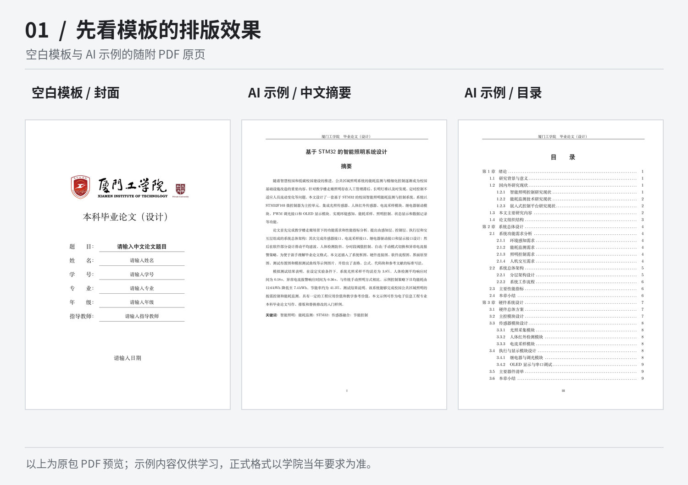
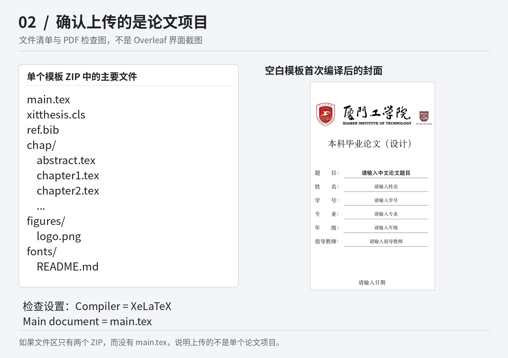
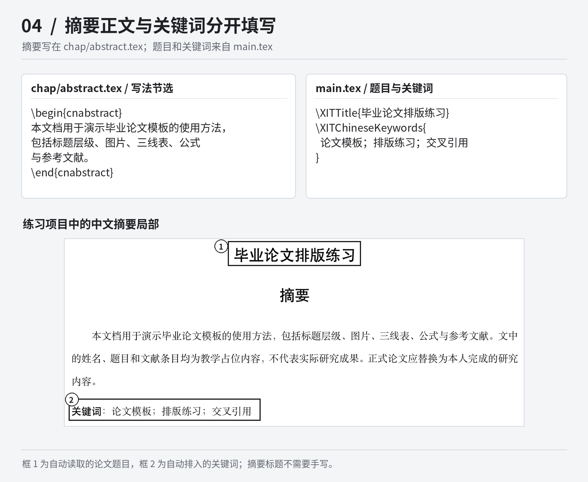
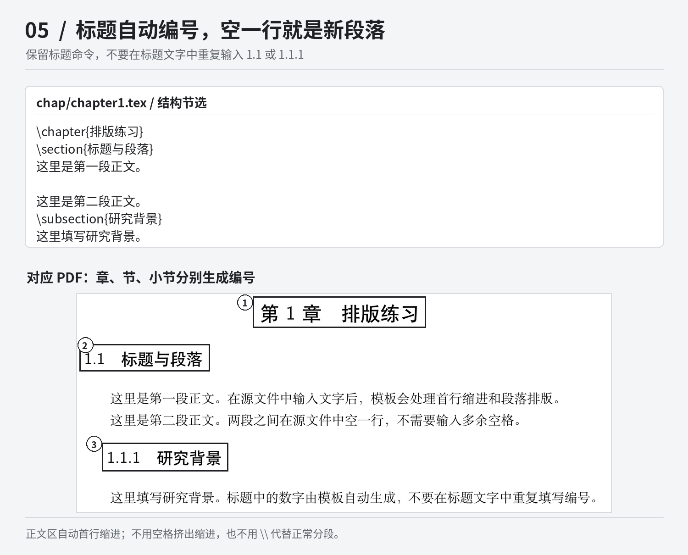
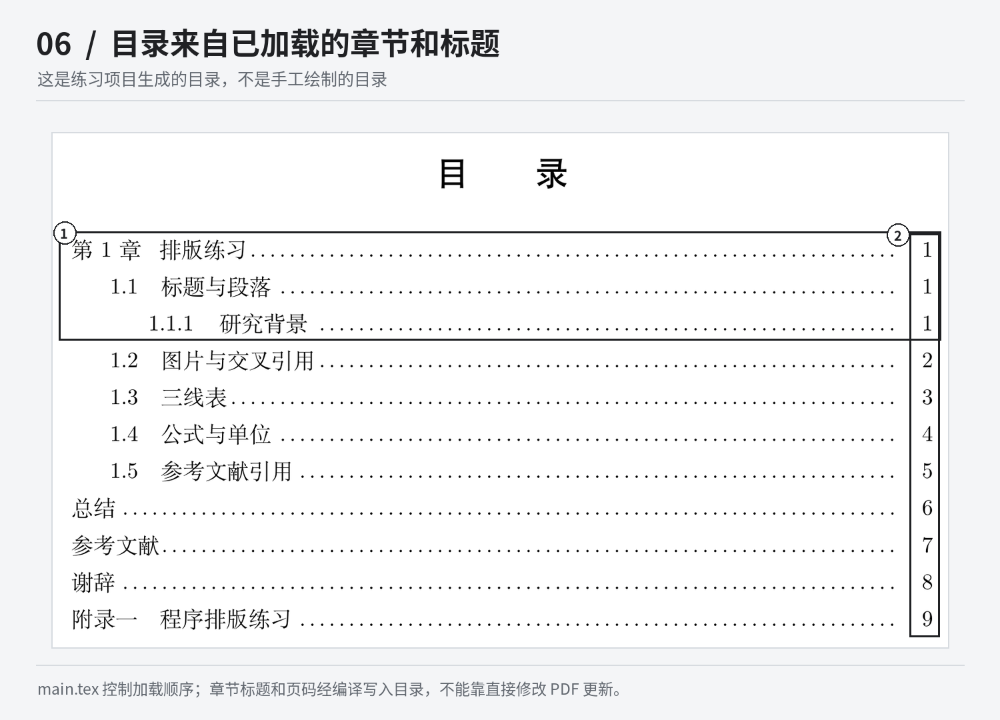
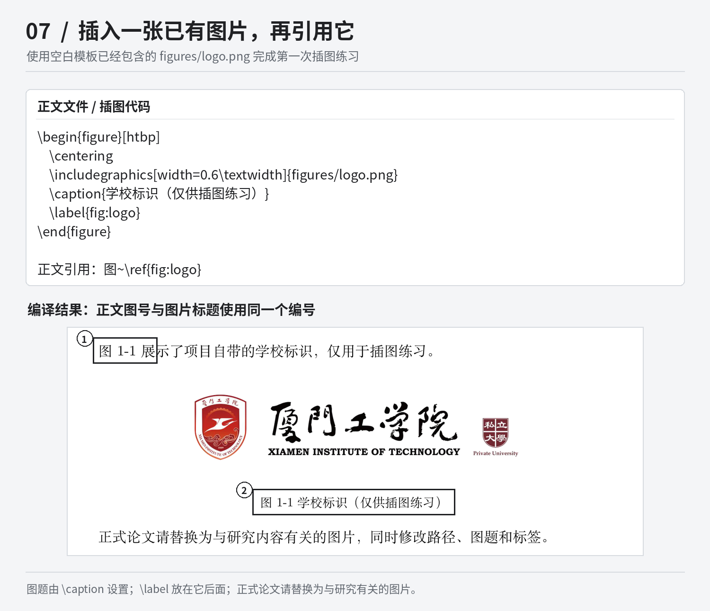
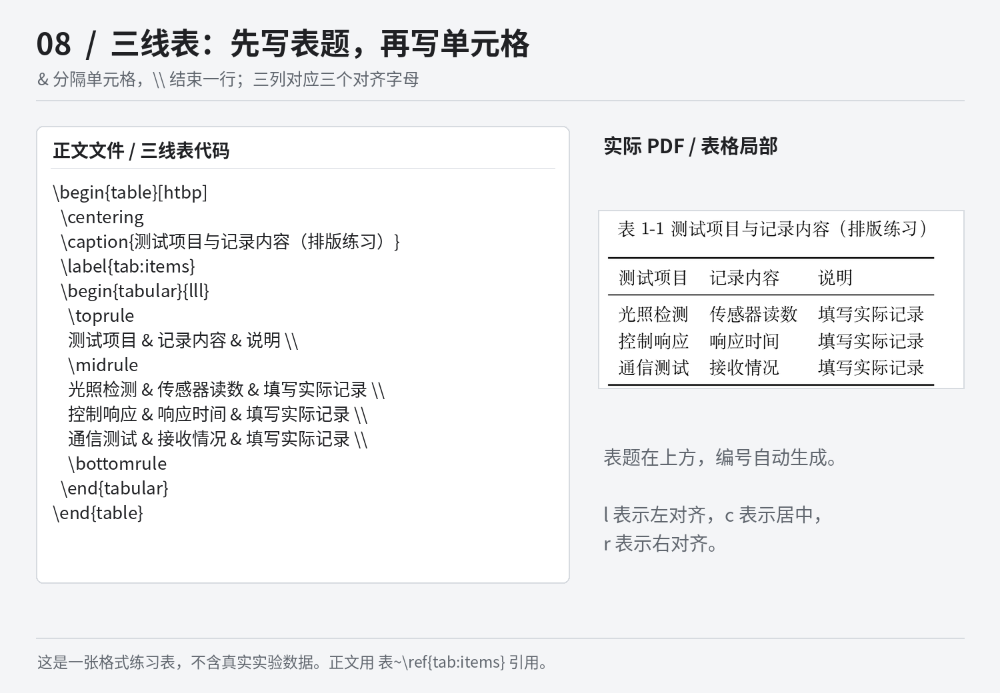
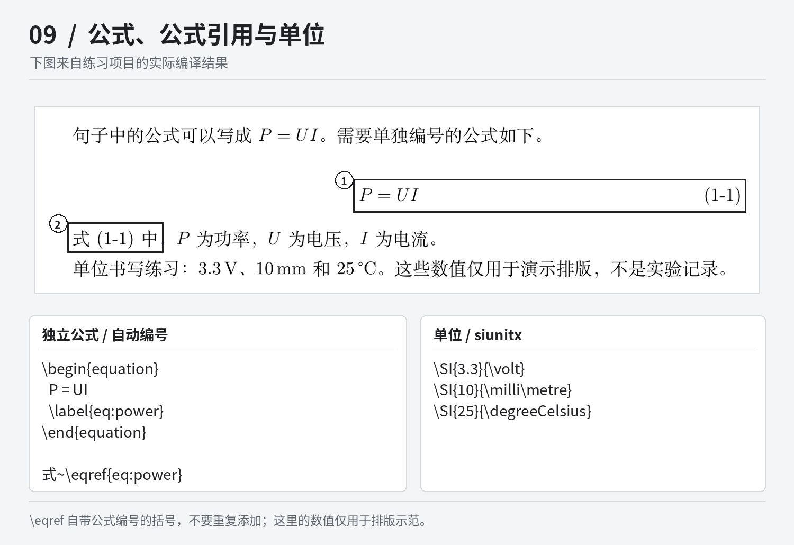
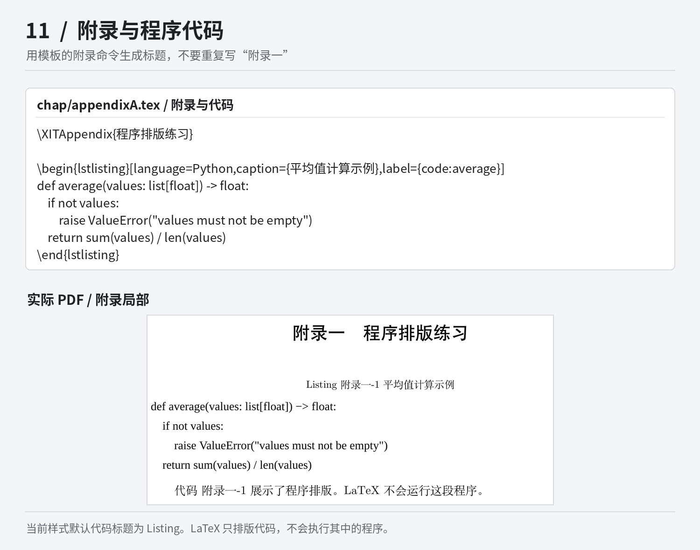

# 厦门工学院本科毕业论文（设计）LaTeX 模板

这是一套面向厦门工学院本科生的毕业论文（设计）LaTeX 模板，包含封面、声明页、中英文摘要、目录、正文、参考文献、总结、谢辞和附录。模板把论文内容和排版设置分开：平时主要写正文、替换图片和录入文献，标题编号、图表编号和目录交给模板处理。

第一次接触 LaTeX，可以从下面的“第一次编译”开始，先改好自己的姓名，再逐步写摘要和正文。文中的配图既展示修改位置，也展示实际生成的 PDF；代码块保留了可以复制的写法，不需要照着截图逐字输入。

> 本项目是非官方模板，正式提交前请核对所在学院、专业和指导教师当年的要求。AI 示例论文及本页练习中的内容、图片和文献占位条目只用于教学，不能作为真实研究成果提交。



*上图来自两套模板随附的 PDF。后面的操作对照图来自使用同一份样式文件编译的练习项目，采用回退字体；更换字体后，字形、换行和分页可能有所不同。*

**按需查看：** [第一次编译](#start) · [封面与摘要](#metadata) · [正文与目录](#chapters) · [图片、表格和公式](#objects) · [参考文献](#references) · [总结与附录](#backmatter) · [常见问题](#troubleshooting) · [本地编译与字体](#local) · [导出与备份](#export)

<a id="start"></a>
## 从下载到第一次编译

### 先选对压缩包

仓库中的两套主要材料用途不同。**正式写论文，从空白模板开始；学习写法时，对照 AI 示例论文。**

| 文件 | 用法 |
| --- | --- |
| [厦门工学院毕业设计论文模板.zip](厦门工学院毕业设计论文模板.zip) | 空白写作模板。保留章节结构、占位文字和中文注释，适合替换为自己的论文内容。 |
| [厦门工学院AI示范论文.zip](厦门工学院AI示范论文.zip) | 教学示例。以“基于 STM32 的智能照明系统设计”为题，演示章节、图表、公式、文献和附录如何放在一起。 |

可以点击上面的文件名进入 GitHub 文件页面，再下载对应 ZIP。也可以在仓库首页点击 `Code`，选择 `Download ZIP` 下载整个仓库；这是 GitHub 的[源码下载入口][github-download]。

下载整个仓库后，**先解压最外层压缩包**，取出里面的 `厦门工学院毕业设计论文模板.zip`。上传到 Overleaf 的应当是这个单独的论文项目，而不是同时装着 README、配图和两套模板的仓库总压缩包。仓库名称可能不同，判断时看里面是什么文件，不要只看压缩包名字。

本文还附有一份更小的[配图练习项目](docs/examples/quickstart-demo.zip)和它的[编译结果](docs/examples/quickstart-demo.pdf)，专门对应后面的操作截图。它不是第三套正式论文模板，只用于练习；想照图逐项操作，可以另建一个 Overleaf 项目上传它，不要覆盖已经写好的论文。练习项目的具体说明见 [docs/examples/README.md](docs/examples/README.md)。

### 在 Overleaf 中上传并设置编译器

LaTeX 的基本过程是“编辑源文件，再编译成 PDF”。`.tex` 是可以继续修改的论文源文件，PDF 是排版后的成品。Overleaf 提供在线编辑和编译环境，不准备安装本地软件的同学，可以先用它完成下面的练习。

登录 [Overleaf][overleaf] 后，在项目列表选择 `New Project`，再选择 `Upload Project`，上传单个论文 ZIP。上传成功后，文件区应能看到 `main.tex`、`xitthesis.cls`、`ref.bib` 和 `chap/` 等文件。如果仍然只看到两个 ZIP，而看不到论文源文件，说明需要回到上一步重新选择压缩包。[Overleaf 官方上传说明][overleaf-upload]中有对应的操作截图。

打开项目设置，在新版界面中点击齿轮按钮，再进入 `Compiler` 设置。将 **Compiler 设为 `XeLaTeX`**，将 **Main document 设为 `main.tex`**。旧版界面的入口可能叫 `Menu`，位置不同，但这两个设置值相同。不要选择 pdfLaTeX，也不要把某一章的 `chapter1.tex` 设成主文件；当前模板的样式文件明确要求使用 XeLaTeX。[编译器设置][overleaf-compiler]和[主文件设置][overleaf-main]可以分别对照官方文档确认。

`TeX Live version` 是另一项设置，不是编译器名称。第一次使用可以先保留项目默认值；项目已经能正常编译后，不必为了改正文而来回切换版本。不同环境的宏包和字体可能不同，遇到兼容问题时应当保留报错和版本信息，再定位原因。



*这是一张项目文件与 PDF 的检查图，不是 Overleaf 界面截图。左侧清单来自空白模板，右侧是空白模板的封面预览。*

### 先只改一个姓名

打开 `main.tex`，找到下面这一行，把大括号中的“请输入姓名”换成自己的名字：

```tex
\XITAuthor{请输入姓名}
```

点击 `Recompile`（重新编译），查看新生成的 PDF。封面上的姓名也变化了，就说明你已经完成了最基本的“编辑—编译—检查”过程。接下来再填写其他信息，不必一次替换整篇论文。

空白模板中的“请输入……”和“这里填写……”都是占位文字，出现它们是正常的。由于正文没有启用示例文献引用，初始参考文献列表也可能为空，不要仅凭这一点判断编译失败。

检查修改效果时，要看**本次编译的 PDF 预览**。压缩包中自带的 `preview.pdf` 和原有 `main.pdf` 是已经生成的文件，特别是 `preview.pdf`，不会因为你改了 `.tex` 就自动更新。若预览仍显示旧内容，先确认本次编译是否成功。

<a id="metadata"></a>
## 填写封面和中英文摘要

### 封面信息集中在 main.tex

在 `main.tex` 中找到“论文基本信息”部分。下面用一组练习信息说明写法，正式使用时请替换为自己的实际内容；每行后面以 `%` 开始的原有注释可以保留。

```tex
\XITSchool{厦门工学院}
\XITThesisName{本科毕业论文（设计）}
\XITTitle{毕业论文排版练习}
\XITEnglishTitle{A Thesis Typesetting Exercise}
\XITAuthor{示例同学}
\XITStudentID{2022000000}
\XITMajor{示例专业}
\XITGrade{2022 级}
\XITSupervisor{示例教师}
\XITDate{2026 年 5 月}
\XITChineseKeywords{论文模板；排版练习；交叉引用}
\XITEnglishKeywords{thesis template; typesetting exercise; cross-reference}
```

**保留反斜杠、命令名称和成对的大括号，只改大括号里的内容。** 例如填写姓名时，应当修改 `\XITAuthor{...}`，而不是删除整条命令后单独写一个名字。命令中的大括号、反斜杠、方括号都要使用英文半角字符，正文中的中文标点不受这个要求影响。

`\XITGrade` 填写的是入学年级，不是毕业年份；指导教师、专业名称和封面日期按实际要求填写。中文题目会出现在封面和中文摘要中，英文题目会出现在英文摘要中，因此修改题目后应当一起检查这几处。


*图中的框 1 对应中文题目，框 2 对应姓名。其余信息按相同方式从 main.tex 读取。*

学校标识由 `\XITLogo{figures/logo.png}` 加载，日常写作可以保留。确需替换时，把新图片放入 `figures/`，再修改命令中的路径。当前封面题目栏是固定宽度，特别长的题目可能需要调整封面样式，不要堆空格强行对齐，也不要为适应一行而擅自缩短已经确定的论文题目。

### 摘要正文写在 abstract.tex，关键词仍在 main.tex

打开 `chap/abstract.tex`，保留中英文摘要的起止命令，替换中间的文字。下面的内容仅说明填写位置，不是论文摘要范文。

```tex
\begin{cnabstract}
这里填写中文摘要。请使用自己实际完成的研究内容，
说明研究问题、方法、主要结果和结论。
\end{cnabstract}

\begin{enabstract}
Replace this paragraph with the English abstract of your thesis.
\end{enabstract}
```

`\begin{cnabstract}` 和 `\end{cnabstract}` 分别表示中文摘要的开始与结束，英文摘要同理。不要删除这些命令，也不需要在里面重新输入论文题目、“摘要”或“Abstract”标题，模板已经负责生成它们。

关键词回到 `main.tex` 中修改。中文关键词在 `\XITChineseKeywords{...}` 中填写，用中文分号分隔；英文关键词在 `\XITEnglishKeywords{...}` 中填写，用英文分号分隔。不要在摘要末尾又手写一行关键词，否则会重复。



*上方展示两个文件的填写位置，下方是练习项目的中文摘要局部。英文摘要按相同思路填写。*

现在可以做一次检查：封面信息是否正确，中英文题目是否对应，摘要中是否还留有教学文字，关键词是否只出现了一次。确认这些没有问题后，再开始写正文。

<a id="chapters"></a>
## 写正文，并让目录自动更新

### 先认识文件之间的关系

下面是**单个论文 ZIP 解压后的主要结构**，不是最外层仓库的结构。仓库中的 `docs/` 用于存放本页配图和练习材料，不是正式论文的章节文件夹。

```text
main.tex                      全文入口：基本信息、关键词、章节加载顺序
xitthesis.cls                 样式文件：封面、字体、标题、页边距等
ref.bib                       参考文献数据库
chap/
    abstract.tex              中英文摘要
    chapter1.tex              第 1 章
    chapter2.tex              第 2 章
    chapter3.tex              第 3 章
    chapter4.tex              第 4 章
    chapter5.tex              第 5 章
    conclusion.tex            总结
    acknowledgements.tex      谢辞
    appendixA.tex             第一个附录
    appendixB.tex             第二个附录
figures/
    logo.png                  模板已包含的学校标识
fonts/
    README.md                 字体说明
LATEX_OVERLEAF_GUIDE.md        项目自带的进一步教程
FORMAT_CHANGELOG.md           版式调整记录
copy_windows_fonts.ps1        Windows 字体复制脚本
Makefile                      本地编译命令
preview.pdf                   随包预览
main.pdf                      随包编译结果
```

日常主要使用 `main.tex`、`chap/`、`figures/` 和 `ref.bib`。可以把 `main.tex` 理解为整篇论文的入口，`chap/` 中的文件是各部分内容，`xitthesis.cls` 则决定它们的版式。只是写论文时，先不要修改 `.cls` 文件；姓名和正文也不在这里填写。

### 标题写内容，编号交给模板

打开 `chap/chapter1.tex`，替换章标题、节标题和占位正文。下面的写法会生成一章，其中包含一个节和一个更低一级的小节。

```tex
\chapter{排版练习}

\section{标题与段落}
这里是第一段正文。在源文件中输入文字后，模板会处理首行缩进和段落排版。

这里是第二段正文。两段之间在源文件中空一行，不需要输入多余空格。

\subsection{研究背景}
这里填写研究背景。标题中的数字由模板自动生成，不要在标题文字中重复填写编号。
```

`\chapter` 表示章，`\section` 表示章下面的节，`\subsection` 再向下一层。它们分别生成“第 1 章”“1.1”“1.1.1”这样的编号，所以应当写 `\section{研究背景}`，不要写 `\section{1.1 研究背景}`。

普通中文直接输入即可。**段落之间空一行**；只在源文件里按一次回车，通常仍然属于同一段。模板会处理首行缩进，不要用连续空格制造缩进，也不要在每段末尾加 `\\`，后者表示强制换行，不等同于正常分段。



*截图中只有标题文字来自大括号，前面的编号由模板生成。实际论文应按课题内容命名章节，不必照搬“排版练习”。*

源文件里以 `%` 开始的内容是注释，该行后面的内容不会进入 PDF。需要在普通正文中显示半角百分号时，写成 `\%`；下划线、与号和井号分别写成 `\_`、`\&`、`\#`。例如“误差为 5%”和变量名可以这样写：

```tex
误差为 5\%。变量名为 sensor\_value。
```

数学公式中的下划线另有用途，后面会单独说明。复制 README 中的示例时，只复制代码块内部的文字，不要把代码块边界的三个反引号和 `tex` 字样一起粘贴进去。从其他文档粘贴正文后，出现报错时先检查特殊字符和大括号是否完整。

### 增减章节，要同时修改 main.tex

`main.tex` 中的下面几行决定正文加载哪些文件以及它们的顺序。文件名省略了 `.tex`，`\include{chap/chapter1}` 对应的实际文件就是 `chap/chapter1.tex`。

```tex
\include{chap/chapter1}
\include{chap/chapter2}
\include{chap/chapter3}
\include{chap/chapter4}
\include{chap/chapter5}
\include{chap/conclusion}
```

只需要四章时，把第五章的入口改为 `% \include{chap/chapter5}` 即可，文件可以暂时保留。需要第六章时，在 `chap/` 中新建 `chapter6.tex`，写入 `\chapter{补充实验与分析}` 和正文，再在总结之前加入 `\include{chap/chapter6}`。只新建文件而不添加入口，不会让它自动出现在论文里。

章节编号跟随实际加载顺序，不是根据文件名中的数字决定。章节文件中也不需要重复写 `\documentclass`、`\begin{document}` 或 `\end{document}`，这些整篇文档的结构已经由 `main.tex` 提供。



*这是配图练习项目的目录。正式论文的目录长度和页码会随内容变化。*

模板会根据已加载的标题生成目录。增加或删除内容后，先完成编译，再核对目录页码和交叉引用；不要去修改 PDF 中的目录文字。整章之间自动换页是当前组织方式的正常行为，不要靠不断添加空行把下一章推到新的一页。

<a id="objects"></a>
## 把图片、表格和公式放进论文

### 用项目已有的图片完成第一次插图

初次练习直接使用空白模板已经包含的 `figures/logo.png`，这样不需要额外准备图片。将下面的代码放在某一章的正文位置，不要放进 `xitthesis.cls`，也不要放在 `\begin{document}` 之前。

```tex
图~\ref{fig:logo} 展示了项目自带的学校标识，仅用于插图练习。

\begin{figure}[htbp]
    \centering
    \includegraphics[width=0.6\textwidth]{figures/logo.png}
    \caption{学校标识（仅供插图练习）}
    \label{fig:logo}
\end{figure}
```

`\includegraphics` 负责加载图片，`width=0.6\textwidth` 表示宽度为正文区域宽度的 60%。调大或调小这个数值即可改变显示大小。一般只指定宽度，让高度随比例变化，避免同时指定不合适的宽高后把图片拉伸。

`\caption` 设置图片标题，`\label{fig:logo}` 为图片设置内部标签。正文中的 `\ref{fig:logo}` 读取同一个标签对应的图号。**标签放在 `\caption` 后面，每张图使用不同的标签。** `fig:` 只是方便区分图片标签的命名习惯，不是文件路径；只有 `\includegraphics` 中的路径需要对应真实图片文件。



*图中的两处编号指向同一张图片。前面增加新图后，完成编译即可更新编号，不必手改“图 1-1”。在自己的第 2 章中使用时，图号可能是“2-1”，以实际编译结果为准。*

换成自己的图片时，先上传到 `figures/`。例如确实上传了 `system.png`，再把代码中的路径改为 `figures/system.png`，同时修改图题以及 `\label`、`\ref` 中的标签。文件名建议使用英文、数字和下划线，路径中的大小写和扩展名保持一致。空白模板没有自带 `system.png`，不能只改路径却没有上传文件。

`[htbp]` 给出了允许尝试的排放位置，图片可能出现在当前位置、页顶、页底或单独的浮动页，不保证紧贴代码所在的行。先检查图片大小和正文引用，再看最终排版，不要用大量空行“固定”图片。图像尽量使用清晰的原始导出文件；流程图或结构图能导出 PDF 时，也可以使用 PDF 文件，避免把模糊截图反复放大。

### 三线表直接用代码填写，不必做成截图

下面是一张三列表格。内容只用于练习写法，不包含真实测试结果，可以放到 `chap/chapter2.tex` 或其他需要它的章节中。

```tex
测试项目见表~\ref{tab:items}。

\begin{table}[htbp]
    \centering
    \caption{测试项目与记录内容（排版练习）}
    \label{tab:items}
    \begin{tabular}{lll}
        \toprule
        测试项目 & 记录内容 & 说明 \\
        \midrule
        光照检测 & 传感器读数 & 填写实际记录 \\
        控制响应 & 响应时间 & 填写实际记录 \\
        通信测试 & 接收情况 & 填写实际记录 \\
        \bottomrule
    \end{tabular}
\end{table}
```

`{lll}` 表示三列且全部左对齐，`c` 表示居中，`r` 表示右对齐。每行使用 `&` 分隔单元格、使用 `\\` 结束，因此这里每一行有两个 `&`。增加一列时，要同时修改列定义和每行内容，不能只在某一行额外增加一个单元格。

`\toprule`、`\midrule` 和 `\bottomrule` 分别画出顶部、表头下方和底部的横线，模板已经加载所需的 `booktabs` 宏包，不需要重复加载。表题放在表格上方，表格标签同样放在 `\caption` 后面。



*先理解列数、单元格分隔符和换行符，再替换成自己的表格内容。*

表格太宽时，优先精简冗长文字，或将某一列改成 `p{6cm}` 这样的固定宽度列，让内容可以换行。例如 `{llp{6cm}}` 表示前两列左对齐，第三列宽度为 6 cm，具体数值仍要按整张表调整。不建议一开始就把整张表缩到字号过小。普通 `table` 不能自动跨页，确需长表时可以进一步查看模板已加载的 `longtable` 用法。

### 公式与单位：区分行内公式和独立公式

句子中的短公式可以写在 `\(` 和 `\)` 之间。需要单独成行并编号时，使用 `equation` 环境；环境里面不需要再套一层 `\(...\)`。

```tex
句子中的公式可以写成 \(P = UI\)。

\begin{equation}
    P = UI
    \label{eq:power}
\end{equation}

式~\eqref{eq:power} 中，\(P\) 为功率，\(U\) 为电压，\(I\) 为电流。
```

`\eqref` 读取公式编号，并自动带上括号，不需要再在它外面手工加一组括号。公式中的下标使用 `_`，上标使用 `^`，包含多个字符时用大括号括起来，例如 `\(x_{max}\)`；分式使用 `\frac{分子}{分母}`。这些写法应当放在数学环境里，不要直接当作普通正文输入。

模板已加载 `siunitx`，数字和单位可以统一这样写。下面的数值仅为格式示例，不是实验参数。

```tex
工作电压为 \SI{3.3}{\volt}。
测量长度为 \SI{10}{\milli\metre}。
环境温度为 \SI{25}{\degreeCelsius}。
```



*图表、公式的标签都应避免重名。改变顺序后，先完成编译，再确认引用是否更新。*

空白模板在 `chapter2.tex` 中还保留了一些被 `%` 注释掉的图表和公式示例。要启用其中一段，需要去掉整段有效代码前面的注释符号，并替换实际内容；只去掉 `\begin` 前面的 `%`、却保留 `\end` 的注释，会破坏环境配对。

<a id="references"></a>
## 从 ref.bib 到正文中的参考文献

参考文献有两处需要编辑：`ref.bib` 保存资料的完整信息，正文中的 `\cite{...}` 标明哪里引用了哪篇资料。先把这两处对应起来，再考虑文献种类和具体字段，就容易理解得多。

下面是一条**虚构的格式练习条目**。可以用它测试流程，但正式论文必须替换为自己实际查阅的文献；作者、题目、期刊和年份都不能直接沿用。将它添加到 `ref.bib` 中已有条目的后面，不要放在另一个条目的大括号内部。

```bibtex
@article{demo-reference,
  author  = {示例作者甲 and 示例作者乙},
  title   = {参考文献格式练习条目},
  journal = {示例期刊},
  year    = {2026},
  volume  = {10},
  number  = {2},
  pages   = {1--8},
  note    = {虚构条目，仅供排版练习}
}
```

`@article` 表示期刊论文，紧跟着的 `demo-reference` 是文献键，也就是这条记录的唯一名称。文献键建议使用英文字母、数字和连字符，不能与其他条目重复。多名作者使用 `and` 分隔，相邻字段之间保留英文逗号。`note` 是否显示取决于文献样式，不能靠这个字段代替对示例资料的检查和删除。

接着在任意已加载的正文文件中加入：

```tex
这句话仅用于演示文献引用\cite{demo-reference}，不表达实际研究结论。
```

正文中的文献键必须与 `ref.bib` 完全一致。多条文献可以写成 `\cite{文献键一,文献键二}`，前提是这些记录都已经存在。不要手写 `[1]`，也不要把已经排好版的一整段参考文献文字直接粘进 `.bib` 文件当作条目。


*这张图展示的是引用流程。图中的作者、题名和期刊都是明确标记的虚构教学占位内容。*

本模板已经在 `main.tex` 中设置 `backend=biber` 和 `style=gb7714-2015`，使用 Biber 处理文献，并按所选样式排版。这里说明的是**模板当前的配置**，不是把它称作最新标准，也不代表无需核对学院当年的文献要求。不要另从教程中复制一套 BibTeX、`natbib` 或手工文献环境混进来。[Overleaf 的 biblatex 说明][overleaf-biblatex]介绍了这套工作方式。

在 Overleaf 中通常由平台的构建流程调用文献处理工具，不需要在正文里输入 `biber main`。本地使用时，则应依次执行 `XeLaTeX → Biber → XeLaTeX → XeLaTeX`，具体命令见后文。出现文献键未变成编号的情况，应先核对条目、引用名称和日志；一直重复 XeLaTeX 不能替代缺失的 Biber 步骤。

文末参考文献由 `\XITPrintBibliography` 输出，当前安排在“总结”和“谢辞”之间。只录入 `.bib` 而从未引用的文献，默认不会进入列表。`main.tex` 里的 `% \nocite{*}` 取消注释后会列出数据库中的全部条目，可以用于检查录入结果，但不应代替正文真正需要的引用。

书籍、会议论文、学位论文和网页资料应使用相应条目类型，不能全套期刊论文格式。可以从数据库或文献管理工具导出 BibTeX 作为录入起点，再核对作者、题名、卷期、页码、年份以及必要的链接或访问日期。空白模板原有的 `sample-reference` 同样是占位示例，定稿时应清理无效条目和示例引用。

<a id="backmatter"></a>
## 完成总结、谢辞和附录

总结在 `chap/conclusion.tex` 中填写。保留开头的 `\XITConclusion`，将它下面的占位文字替换为自己的总结。这条命令已经生成标题并加入目录，不需要再写一遍 `\chapter{总结}`。

谢辞在 `chap/acknowledgements.tex` 中填写，保留 `\XITAcknowledgement`，替换其后的正文即可。当前模板使用的标题是“谢辞”；所在学院有其他规定时，再统一调整样式或标题设置，不要在正文中叠加另一个标题。

```tex
% chap/conclusion.tex
\XITConclusion
这里填写全文总结。
```

```tex
% chap/acknowledgements.tex
\XITAcknowledgement
这里填写谢辞。
```

附录适合放完整代码、较长推导、问卷和补充记录。打开 `chap/appendixA.tex`，使用 `\XITAppendix{附录标题}` 生成附录标题和目录条目。模板会依次生成“附录一”“附录二”，大括号里只写题目，不要把附录序号也写进去；本模板使用自己的附录命令，无需额外再加其他教程中的 `\appendix`。

代码可以放在 `lstlisting` 环境中。以下例子使用 Python，`language=C` 则适用于 C 语言。`caption` 是代码标题，`label` 是正文引用时使用的标签。

```tex
\XITAppendix{程序排版练习}

\begin{lstlisting}[language=Python,caption={平均值计算示例},label={code:average}]
def average(values: list[float]) -> float:
    if not values:
        raise ValueError("values must not be empty")
    return sum(values) / len(values)
\end{lstlisting}

代码~\ref{code:average} 展示了程序排版。LaTeX 不会运行这段程序。
```

这段代码示例按 [Python 3.9 起支持的内置集合类型标注][python-generics]书写；在 LaTeX 里它只是被排版成文本，并没有被执行。当前样式的代码标题默认显示 `Listing`，正文仍可用中文“代码”配合 `\ref` 引用。若把代码放在正文，复制 `lstlisting` 环境及其引用即可，不要把 `\XITAppendix` 一起放进去。正文通常保留必要的关键片段，长程序再放到附录。



*当前模板的附录序号由命令自动递增。示例程序只用于演示代码环境。*

只保留一个附录时，在 `main.tex` 中注释掉第二个附录的入口。完全不需要附录时，把下面两行都注释掉：

```tex
% \include{chap/appendixA}
% \include{chap/appendixB}
```

不要只清空附录正文，却留下标题命令和加载入口，否则仍可能生成一个空附录。声明页的签名和日期也要按学院要求处理，模板生成了声明页面，并不等于已经完成签署。

<a id="troubleshooting"></a>
## 编译出错时，先检查刚改过的地方

每写完一小段、插入一张图或录入一组文献，就编译一次。这样出现问题时，通常能把范围缩小到最近的修改。打开日志后先看**最早出现的实质错误**，后面几十条提示可能都由同一个遗漏引起，不要同时改动许多无关设置。

**提示需要 XeLaTeX，或中文显示异常。** 出现 `This class requires XeLaTeX` 时，直接检查编译器。其他中文问题还应检查文件是否保存为 UTF-8、字体是否可用，不是所有异常都能靠换编译器解决。编辑器叫什么名字，并不决定它实际调用了哪个编译程序。

**提示找不到文件或字体。** `File ... not found` 后面的文件名很重要：缺图片时核对上传情况和路径；缺 `xitthesis.cls` 或章节文件时核对项目是否完整；缺 `.sty` 文件时检查宏包安装。`fontspec` 的报错则要看具体字体名称，缺少字体和图片路径错误不是同一个问题。

**提示命令不存在或括号不匹配。** 出现 `Undefined control sequence`，先检查命令拼写，或是否复制了模板没有加载的宏包命令。出现 `Missing $ inserted`，检查普通正文里是否有未转义的下划线，或数学内容是否缺少数学环境。还应核对 `\begin{...}`、`\end{...}` 和大括号是否成对，包括有没有误把结尾命令注释掉。

**图表显示 `??`，或文献没有变成编号。** 图表先核对 `\label` 与 `\ref` 的名称、重复标签以及章节加载入口，再完成编译更新引用。文献还要检查 `ref.bib` 和 Biber。名称拼错、条目语法错误、图片缺失，都不会因为多编译几遍而自动修复。

**编译通过，但 PDF 没变化或目录未刷新。** 先确认正在看本次生成的 PDF，而不是随包预览；再确认修改文件仍被 `main.tex` 加载。源文件正确而辅助信息没有更新时，可在 Overleaf 的重新编译菜单中使用 `Recompile from scratch` 清理缓存后重建。这个操作不会修复源代码错误，具体入口见[清理项目缓存][overleaf-cache]。

**有警告，或图片位置与预期不同。** `Overfull \hbox` 常提示某一行过宽，应结合 PDF 检查长网址、表格或不可断行的内容；浮动图片移到页顶或下一页则未必是错误。成功生成 PDF 不等于没有排版问题。字体回退提示、书签提示和阻断编译的错误也应分开判断，不要看到一条警告就删除整个样式文件。

配图练习项目已按完整顺序在本地编译生成 14 页 PDF，具体环境和保留的警告写在[练习说明](docs/examples/README.md)中。这说明对应代码走通了引用流程，不代表已经在每个 Overleaf 版本和每台电脑上测试过。

<a id="local"></a>
## 本地编译与字体设置

只使用 Overleaf 且当前能正常编译的同学，可以先跳到下一节。字体和本地环境应在需要时处理，不必为了开始写正文先改一遍全部设置。

### 本地需要 LaTeX 环境，不只是编辑器

可以使用 [TeX Live][texlive]，macOS 也可以使用 [MacTeX][mactex]。安装的环境需要提供 `xelatex`、`biber` 以及模板使用的宏包和字体。只安装一个代码编辑器，并不能完成论文编译。

将整个论文项目解压，在包含 `main.tex` 的目录打开终端。如果用命令进入目录，路径中包含空格时加英文双引号。确认当前位置后，依次执行：

```bash
xelatex main.tex
biber main
xelatex main.tex
xelatex main.tex
```

第一遍 XeLaTeX 生成正文和辅助信息；Biber 根据引用处理 `ref.bib`；后两遍 XeLaTeX 将文献、目录和交叉引用结果写回 PDF。注意第二条是 `biber main`，不是 `biber ref.bib`。某一步发生阻断编译的错误时，应先解决它，再继续后续步骤。

终端提示找不到 `xelatex` 或 `biber`，说明应检查发行版安装与命令路径，而不是修改论文内容。完整编译后，输出文件为当前项目中的 `main.pdf`。`.aux`、`.toc`、`.bcf`、`.bbl` 等是构建过程中的辅助文件，不是日常写作入口，不需要手工编辑；排错前可以先保留日志。

项目 `Makefile` 已包含上述编译顺序，在安装了 `make` 的兼容环境中可以运行 `make`。`make clean` 用于清理辅助文件，但规则使用了 `rm`，Windows 原生命令行不一定具备相同环境；不熟悉这些工具时，直接使用四条编译命令即可。源文件和文献文件均应保存为 UTF-8。

### 字体回退不等于与原字体完全一致

当前 `xitthesis.cls` 优先尝试项目 `fonts/` 中的宋体、黑体等文件，再尝试 Windows 系统字体路径；没有对应文件时，进入 FandolSong、FandolHei 和 Liberation Serif 等回退配置。这是模板的具体加载规则，不应理解为任何环境都一定安装了全部依赖；例如日志提示缺少 `Noto Sans Mono` 或 `Liberation Serif` 时，仍需处理实际缺少的字体。

`fonts/README.md` 说明了相关文件。项目没有附带微软字体二进制文件。需要使用这些字体时，应先确认相应使用权限；上传到在线平台或向他人分发，也需要遵守对应字体授权，私人项目并不自动解决授权问题，具体可查阅[微软字体使用与再分发说明][microsoft-fonts]。关于项目内字体的加载方式，可参照 [Overleaf 的 XeLaTeX 与字体说明][overleaf-fonts]。

Windows 用户可以先查看 `copy_windows_fonts.ps1`，再在项目目录的 PowerShell 中执行：

```powershell
.\copy_windows_fonts.ps1
```

脚本只是尝试从本机 `C:\Windows\Fonts\` 复制已经存在的字体，不会下载缺失字体。主要涉及 `simsun.ttc`、`simhei.ttf`，以及 Times New Roman 的 `times.ttf`、`timesbd.ttf`、`timesi.ttf`、`timesbi.ttf`，还会尝试处理仿宋和楷体。留意脚本输出，部分字形缺失时也可能报错；不要为了运行脚本而关闭系统范围的安全限制，确需手工配置时按实际权限和文件名处理。

更换字体可能改变换行和分页，因此应在最终逐页检查前确定使用哪套字体。不要把这些字体随论文源码提交到公开仓库。需要改变页边距、标题字号或页眉页脚时，先备份，再参考 `FORMAT_CHANGELOG.md` 定位 `xitthesis.cls` 中的对应设置，避免对每个标题单独打补丁。

<a id="export"></a>
## 导出 PDF，保存能继续修改的源码

写完以后重新编译，逐页检查最终 PDF。核对封面信息、中英文题目与关键词、目录页码、图表和公式引用，以及参考文献、谢辞和附录的顺序；全文搜索“请输入”“这里填写”“示例”“sample-reference”“demo-reference”，检查是否遗留占位文字、教学数据或无效引用。遇到确实属于正文内容的“示例”一词，应根据上下文判断，不必机械删除。

在 Overleaf 中可通过 PDF 预览区的下载按钮保存本次编译结果，也可从 `File` 菜单选择 `Download as PDF`。除此之外，还应通过 `Download as source (.zip)` 下载一份项目源码 ZIP，保留 `.tex`、图片、文献数据库和样式文件；界面操作可对照[下载项目说明][overleaf-download]。PDF 用于阅读和提交，源码用于后续修改，两者不能互相替代。

初稿、导师修改稿和最终稿可以分别备份，让同一版本的源码和 PDF 对应起来。不要只保留最初下载的模板 ZIP，也不要将已经填写学号、签名或未公开研究内容的个人论文直接上传到公共仓库。

## 进一步查阅与反馈

单个模板中还附有 `LATEX_OVERLEAF_GUIDE.md`，遇到更复杂的图表、文献和编译问题，可以继续查阅。需要追踪版式调整时看 `FORMAT_CHANGELOG.md`，不必把全部配置都放进正文文件。

发现模板问题，欢迎在仓库的 Issues 中说明使用的是空白版、AI 示例版还是本页练习项目，附上编译环境、首个关键错误和能复现问题的最小代码。涉及学校格式要求的，请附对应规范；涉及个人信息的，先做脱敏处理。熟悉 LaTeX 的同学也可以通过 Pull Request 提交修改。

本页配图来源和练习内容说明见 [docs/IMAGE_SOURCES.md](docs/IMAGE_SOURCES.md)。它们用于说明如何使用模板，不替代学校规范，也不表示学校或软件平台对本项目作出认证。

[github-download]: https://docs.github.com/en/repositories/working-with-files/using-files/downloading-source-code-archives
[overleaf]: https://www.overleaf.com/
[overleaf-upload]: https://docs.overleaf.com/managing-projects-and-files/uploading-a-project
[overleaf-compiler]: https://docs.overleaf.com/getting-started/recompiling-your-project/selecting-a-tex-live-version-and-latex-compiler
[overleaf-main]: https://docs.overleaf.com/getting-started/recompiling-your-project/the-main-document
[overleaf-biblatex]: https://www.overleaf.com/learn/latex/Bibliography_management_with_biblatex
[overleaf-cache]: https://docs.overleaf.com/troubleshooting-and-support/clearing-the-project-cache
[overleaf-download]: https://docs.overleaf.com/managing-projects-and-files/downloading-a-project
[overleaf-fonts]: https://www.overleaf.com/learn/latex/XeLaTeX
[texlive]: https://www.tug.org/texlive/
[mactex]: https://www.tug.org/mactex/

[python-generics]: https://docs.python.org/3.9/library/typing.html
[microsoft-fonts]: https://learn.microsoft.com/en-us/typography/fonts/font-faq
